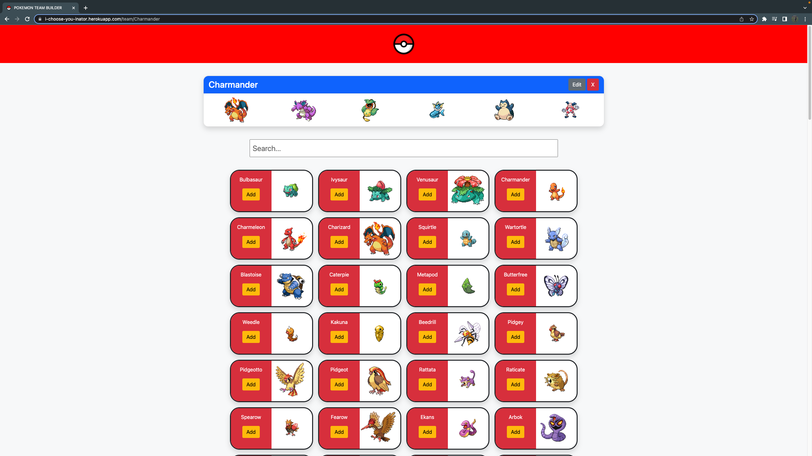
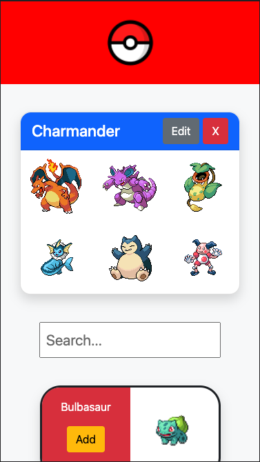

# i-choose-you

## Table of Contents

* [Links](#links)

* [Description](#description)

* [User Story](#userstory)

* [Technologies](#technologies)

* [Tests](#tests)

* [Questions](#questions)

## Links

[Deployed Application](https://i-choose-you-inator.herokuapp.com/)

[Github Repo](https://github.com/cavazosdotcom/i-choose-you)





## Description

This is a Pokemon application where users can theory craft pokemon teams to spend less time deciding which Pokemon to use, and more time playing the game. 

After creating an account and logging in, a user can name/create different teams that they can edit and delete at any time with whichever Pokemon they want (up to 6 total). A user can choose to scroll through the existing Pokemon or search for the Pokemon they want.

Through using [PokeApi](https://pokeapi.co/docs/v2), we were able to use their data to create a list of the first 151 pokemon from the Kanto region. Through using their data we can create our teams with individual Pokemon with their own data properties.

## User Story

```
AS A Pokemon Fan
I WANT to plan out my Pokemon Team
SO THAT I can spend more time playing the game
```

## Acceptance Criteria

```
GIVEN a Pokemon App
WHEN I open the application
THEN I am direcred to Login or Signup
WHEN I Login/Signup
THEN I am directed to my homepage
WHEN I want to create a team
THEN I make a team name and create a team
WHEN I want to add pokemon to my team
THEN I click on the team card I want to edit
WHEN I am directed to edit the team
THEN I observe/search the list of Pokemon
WHEN I find a pokemon I want on my Team
THEN I click the add button, and they are added to the team
WHEN I change my mind and don't want a Pokemon on the team
THEN I click on the Pokemon I no longer want on the team card to remove them
WHEN I am done making my team
THEN I can click the Pokeball in the header to redirect to the Home page
WHEN I want to edit an existing team
THEN I click the edit button on that team's card
WHEN I can to delete an existing team
THEN I click the delete button on that team's card
```

## Technologies

* [PokeApi](https://pokeapi.co/docs/v2)
* MongoDB
* Express.js
* React
* Node.js
* Bootstrap
* Javascript
* GraphQL

## Questions/Contributors

* [Cameron Seibel](https://github.com/CameronMSeibel)

* [Luke Stewart](https://github.com/L-Stew206)

* [Marshall Baccari](https://github.com/mbaccari)

* [Jonathan Chen](https://github.com/Jonathan6)

* [Chris Cavazos](https://github.com/cavazosdotcom)

If you have any questions feel free to contact me at either [Github](https://github.com/cavazosdotcom), or [cavazosdotcom@gmail.com](cavazosdotcom@gmail.com)

## Future Development

As of now we have a few plans to further bolster this application.

* Add Pokedex's from every game

* Give the user the ability to select which game they want to pick Pokemon for

* Adding the types to each pokemon card

* Adding search filters. For example, searching pokemon by type

* Adding a Type Inquiry to inquire and evaluate a teams weaknesses by types

* Recommending possible pokemon to add to a team based on a team's weakness to specific types 